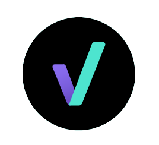

<!--
**LilianaOspina/LilianaOspina** is a ✨ _special_ ✨ repository because its `README.md` (this file) appears on your GitHub profile.

Here are some ideas to get you started:

- 🔭 I’m currently working on ...
- 🌱 I’m currently learning ...
- 👯 I’m looking to collaborate on ...
- 🤔 I’m looking for help with ...
- 💬 Ask me about ...
- 📫 How to reach me: ...
- 😄 Pronouns: ...
- ⚡ Fun fact: ...
-->
# Hi! I'm Liliana!

I’m currently learning about programming on [Certified Tech Developer](https://www.certifiedtechdeveloper.com/)

- 👯 I’m looking to collaborate on projects for beginners

- 🤔 I’m looking for help with Python

- 💬 Ask me about Markdown 💜

## Find me:

[💬 LinkedIn: LilianaOspina](https://www.linkedin.com/in/lilianaospinau/)

[💬 Mail: liliana.ospina.u@gmail.com](mailto:liliana.ospina.u@gmail.com)
